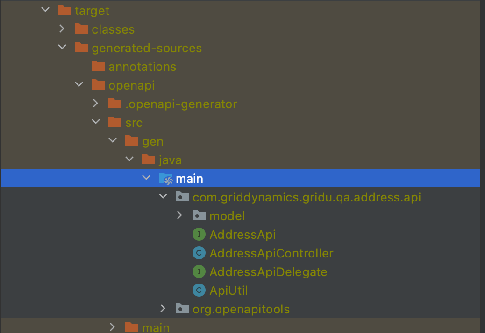

# Backend testing course application (SUT)

A bunch of (micro) services to be tested (as the final task for the backend testing course)<br/>
TODO:
- Readme clean-up
- Maven clean-up (move common dependencies/versions into the parent pom file)
- [REFACTOR] API for updating all addresses/payments for user (by id) should be changed (to return updated list of addresses/payments)
- [NICE_TO_HAVE] Add request validators (based on "business logic" of the app)


To start the app (all services + DB + stub) use Docker-Compose w/o any parameters specified 
(assuming you are at the project root folder):<br/>
```
mvn clean install
docker-compose up
```

In order to start only single (or just not all) component(s) you could list all required 
components as parameters for docker-compose command. E.g. start w/o stub:<br/>
```docker-compose up mysql-docker-container stub am pm um```

For User Management API testing (client generation) you could use the service WSDL available under http://localhost:8080/ws/users.wsdl <br/><br/> 
All components could be also easily started right from your IDE 
(by running corresponding 'main' classes). For DB variables (used in default properties file) 
you need to specify proper values (same as in the db_variables.env file if you are using MySql container created 
by this project's Docker-Compose execution).<br/>
Variables are: *MYSQL_HOST*, *MYSQL_PORT*, *MYSQL_DATABASE*, *MYSQL_USER*, *MYSQL_PASSWORD*<br/>
In addition to this, update *payment.service.url*, *address.service.url* and *payment.gateway.url* environment variables.<br/>
You should also add generated (by Swagger) classes into IDEA 
(by marking corresponding "main" directories as "Generated sources root"):



